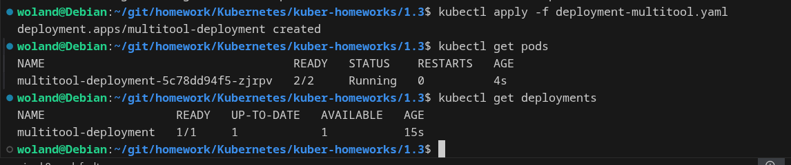
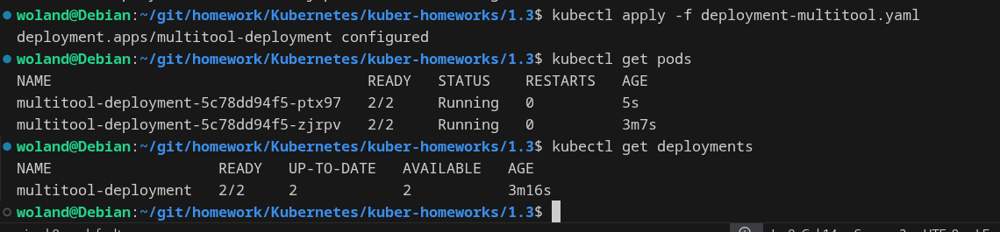
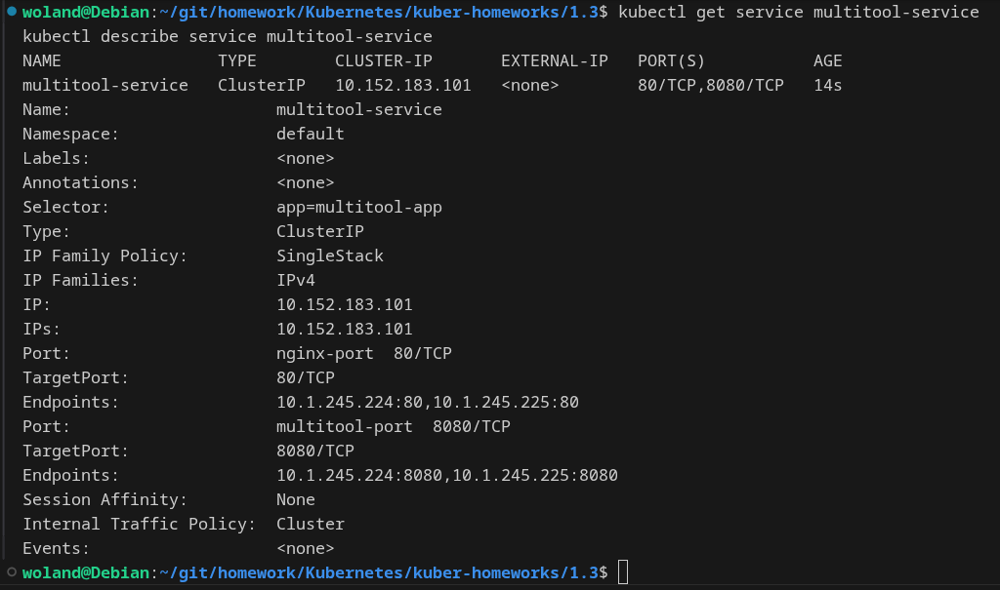
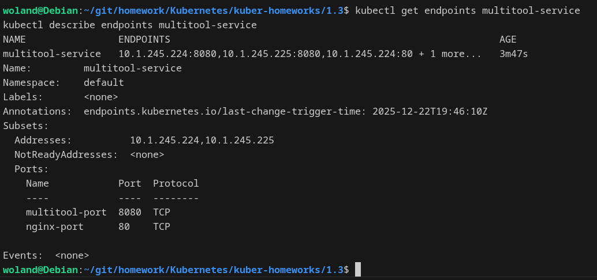
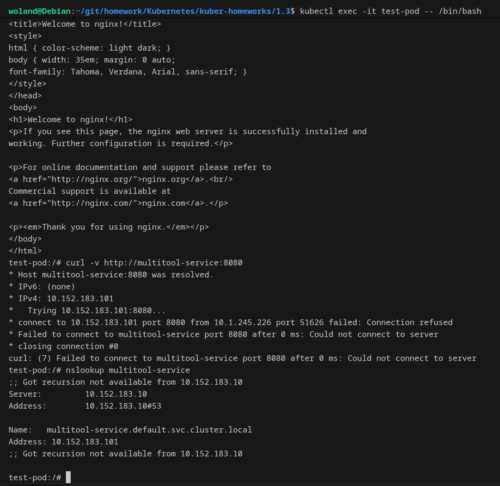
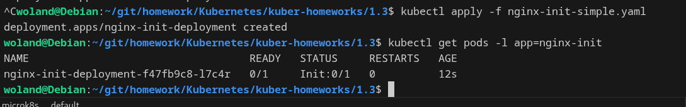
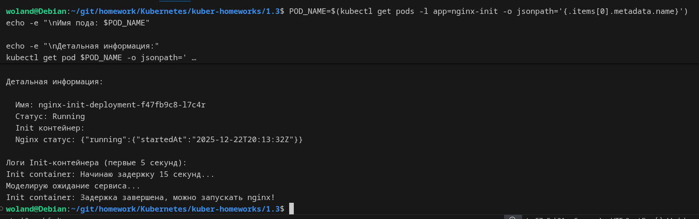
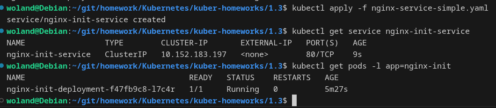
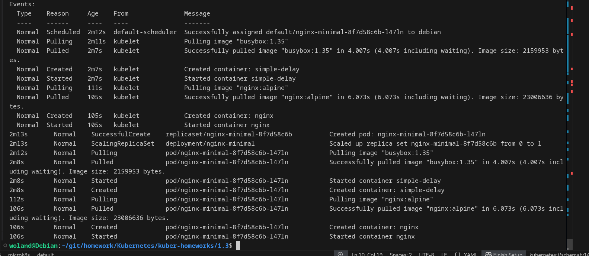

# Домашнее задание к занятию «Запуск приложений в K8S» Барышков Михаил

## Задание 1. Создать Deployment и обеспечить доступ к репликам приложения из другого Pod

1. Создать Deployment приложения, состоящего из двух контейнеров — nginx и multitool. Решить возникшую ошибку.
2. После запуска увеличить количество реплик работающего приложения до 2.
3. Продемонстрировать количество подов до и после масштабирования.
4. Создать Service, который обеспечит доступ до реплик приложений из п.1.
5. Создать отдельный Pod с приложением multitool и убедиться с помощью `curl`, что из пода есть доступ до приложений из п.1.

------

## Решение 1

1. 
[multitool-deployment.yaml](multitool-deployment.yaml)

Возникшая ошибка и решение:
При создании Deployment возникла ошибка, так как оба контейнера пытались использовать порт 80. Решил, назначив multitool порт 8080.

Важно: указываем команду для запуска, так как контейнер multitool не имеет веб-сервера по умолчанию

2. 

Увеличиваем в файле deployment-multitool.yaml **replicas: 2** 

4.
[multitool-service.yaml](multitool-service.yaml)

5.
[test-pod.yaml](test-pod.yaml)

------

## Задание 2. Создать Deployment и обеспечить старт основного контейнера при выполнении условий

1. Создать Deployment приложения nginx и обеспечить старт контейнера только после того, как будет запущен сервис этого приложения.
2. Убедиться, что nginx не стартует. В качестве Init-контейнера взять busybox.
3. Создать и запустить Service. Убедиться, что Init запустился.
4. Продемонстрировать состояние пода до и после запуска сервиса.

------

## Решение 2

1.
[nginx-minimal.yaml](nginx-minimal.yaml)

2.
 
 

3.
[service-minimal.yaml](service-minimal.yaml)
 

4.
 