# Домашнее задание к занятию «Хранение в K8s. Часть 1» - Барышков Михаил

### Задание 1. Volume: обмен данными между контейнерами в поде
### Задача

Создать Deployment приложения, состоящего из двух контейнеров, обменивающихся данными.

### Шаги выполнения
1. Создать Deployment приложения, состоящего из контейнеров busybox и multitool.
2. Настроить busybox на запись данных каждые 5 секунд в некий файл в общей директории.
3. Обеспечить возможность чтения файла контейнером multitool.

### Что сдать на проверку
- Манифесты:
  - `containers-data-exchange.yaml`
- Скриншоты:
  - описание пода с контейнерами (`kubectl describe pods data-exchange`)
  - вывод команды чтения файла (`tail -f <имя общего файла>`)

------

## Решение 1

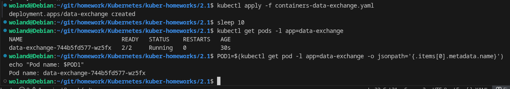
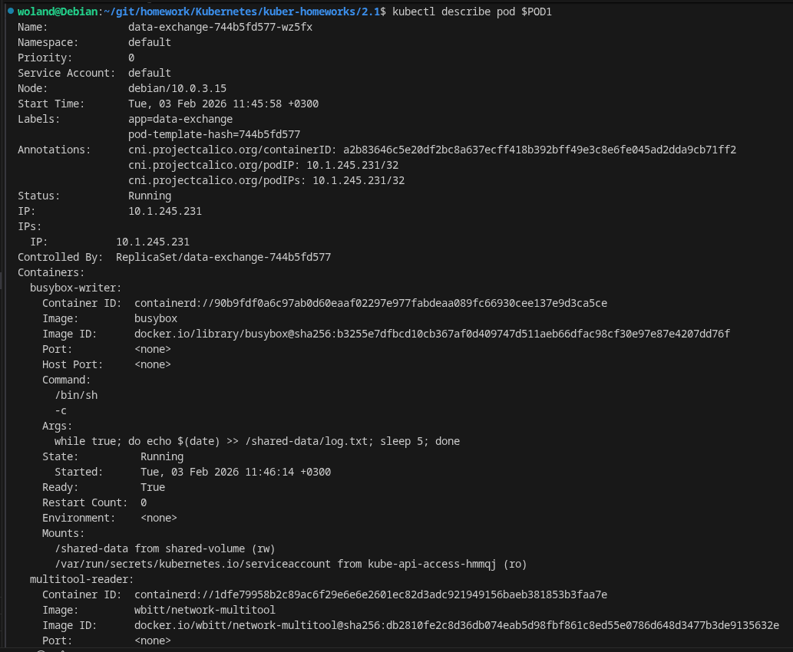
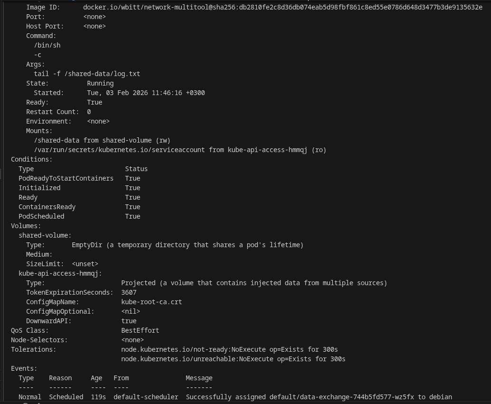
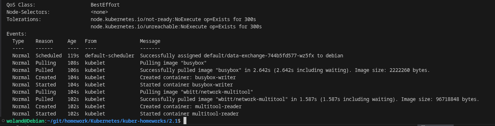
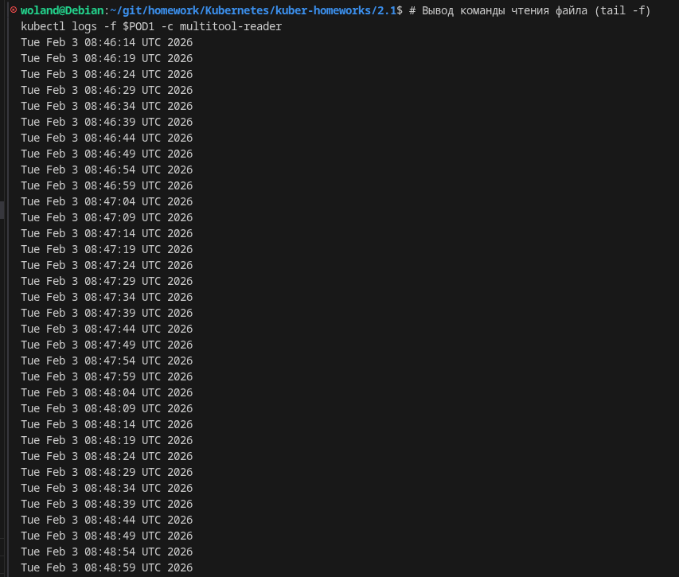

# Задание 2. PV, PVC
### Задача
Создать Deployment приложения, использующего локальный PV, созданный вручную.

### Шаги выполнения
1. Создать Deployment приложения, состоящего из контейнеров busybox и multitool, использующего созданный ранее PVC
2. Создать PV и PVC для подключения папки на локальной ноде, которая будет использована в поде.
3. Продемонстрировать, что контейнер multitool может читать данные из файла в смонтированной директории, в который busybox записывает данные каждые 5 секунд. 
4. Удалить Deployment и PVC. Продемонстрировать, что после этого произошло с PV. Пояснить, почему. (Используйте команду `kubectl describe pv`).
5. Продемонстрировать, что файл сохранился на локальном диске ноды. Удалить PV.  Продемонстрировать, что произошло с файлом после удаления PV. Пояснить, почему.

### Что сдать на проверку
- Манифесты:
  - `pv-pvc.yaml`
- Скриншоты:
  - каждый шаг выполнения задания, начиная с шага 2.
- Описания:
  - объяснение наблюдаемого поведения ресурсов в двух последних шагах.

------

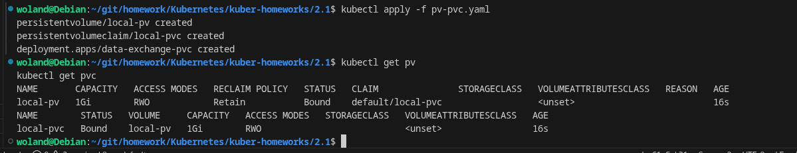
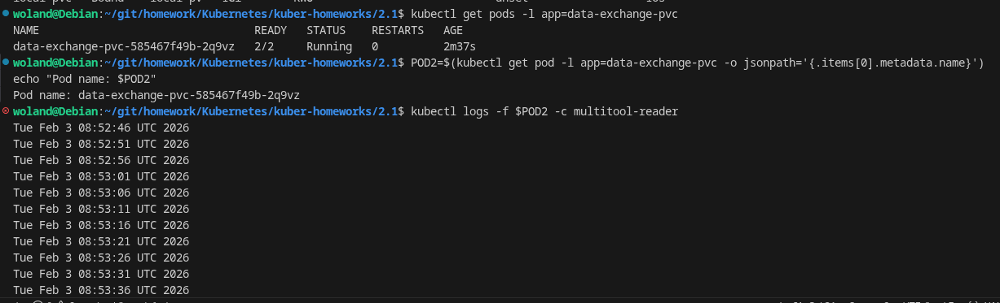
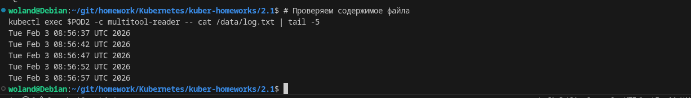
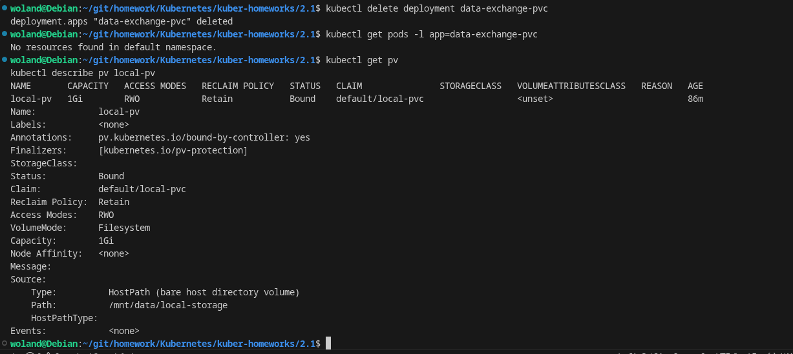
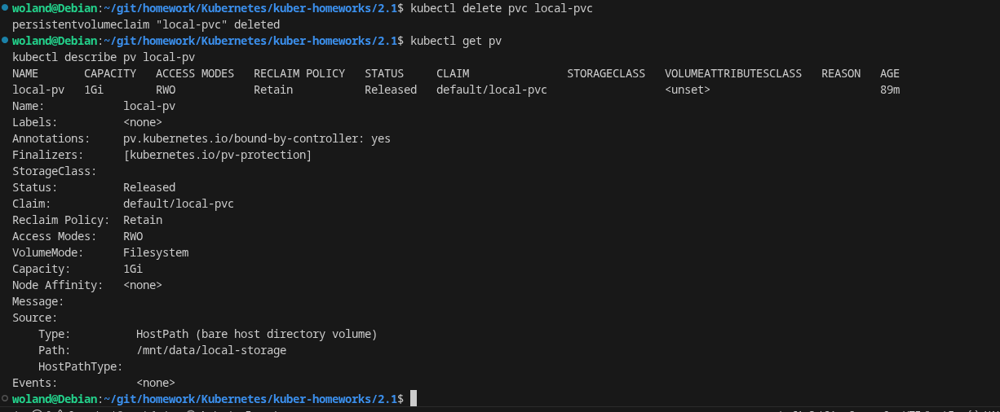
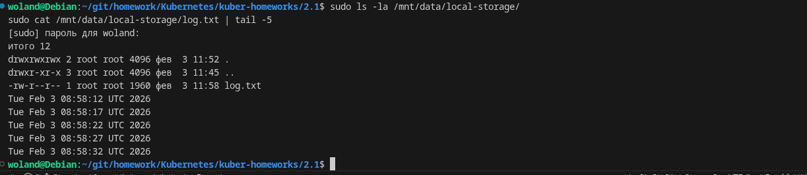
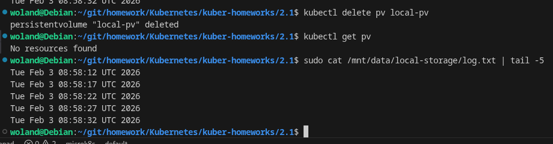

## Объяснения для сдачи:

### Объяснение 1 (после шага 4):
После удаления PVC, PV переходит в состояние Released из-за политики persistentVolumeReclaimPolicy: Retain. В этом состоянии:

- Данные сохраняются на диске
- PV нельзя повторно использовать новым PVC без ручной очистки
- Это защищает от случайной потери данных

### Объяснение 2 (после шага 5):
Файл сохраняется на диске ноды даже после удаления PV, потому что:

- PV типа hostPath только предоставляет доступ к существующему пути на диске
- Kubernetes управляет доступом через объекты PV/PVC, но не управляет фактическими данными на диске
- Удаление PV удаляет только объект Kubernetes, но не физические данные

## Задание 3. StorageClass
### Задача
Создать Deployment приложения, использующего PVC, созданный на основе StorageClass.

### Шаги выполнения

1. Создать Deployment приложения, состоящего из контейнеров busybox и multitool, использующего созданный ранее PVC.
2. Создать SC и PVC для подключения папки на локальной ноде, которая будет использована в поде.
3. Продемонстрировать, что контейнер multitool может читать данные из файла в смонтированной директории, в который busybox записывает данные каждые 5 секунд.

### Что сдать на проверку
- Манифесты:
  - `sc.yaml`
- Скриншоты:
  - каждый шаг выполнения задания, начиная с шага 2
---

## Решение 3

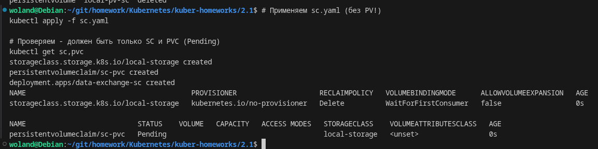
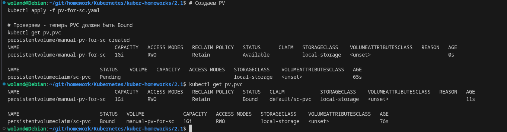
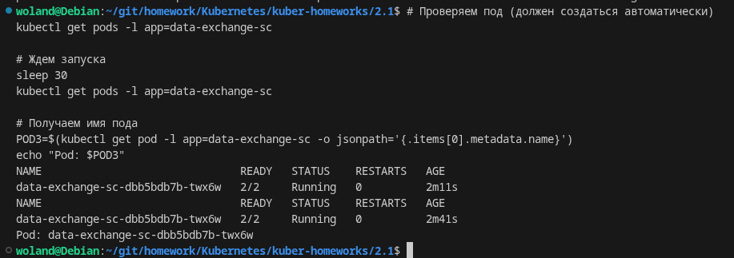
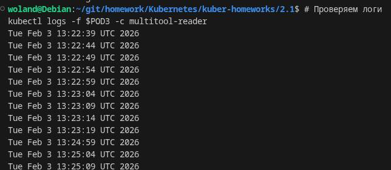
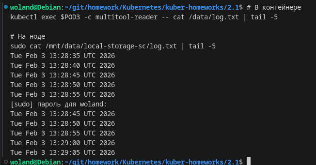
