# Домашнее задание к занятию «Настройка приложений и управление доступом в Kubernetes» -Барышков Михаил

## **Задание 1: Работа с ConfigMaps**
### **Задача**
Развернуть приложение (nginx + multitool), решить проблему конфигурации через ConfigMap и подключить веб-страницу.

### **Шаги выполнения**
1. **Создать Deployment** с двумя контейнерами
   - `nginx`
   - `multitool`
3. **Подключить веб-страницу** через ConfigMap
4. **Проверить доступность**

### **Что сдать на проверку**
- Манифесты:
  - `deployment.yaml`
  - `configmap-web.yaml`
- Скриншот вывода `curl` или браузера
------

## Решение 1

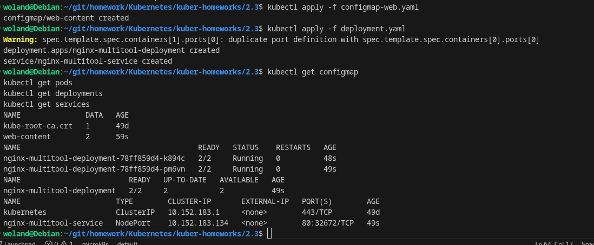
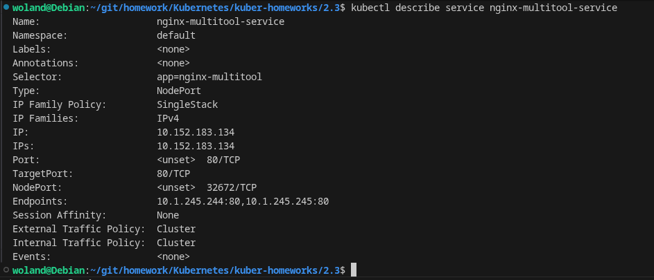
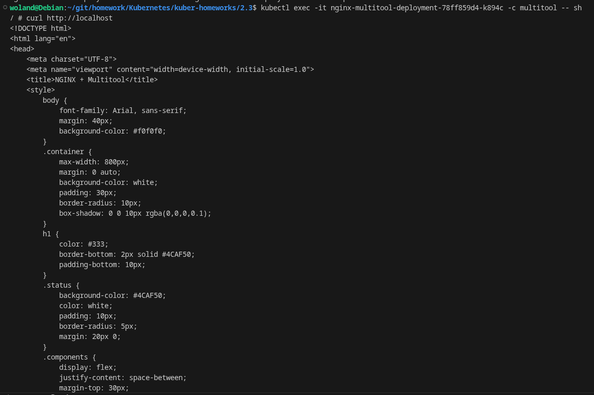
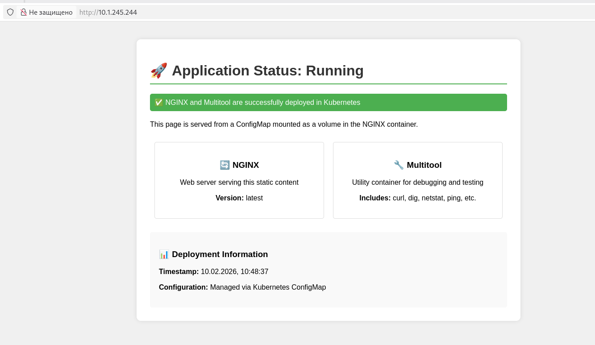

-----

## **Задание 2: Настройка HTTPS с Secrets**  
### **Задача**  
Развернуть приложение с доступом по HTTPS, используя самоподписанный сертификат.

### **Шаги выполнения**  
1. **Сгенерировать SSL-сертификат**
```bash
openssl req -x509 -nodes -days 365 -newkey rsa:2048 \
  -keyout tls.key -out tls.crt -subj "/CN=myapp.example.com"
```
2. **Создать Secret**
3. **Настроить Ingress**
4. **Проверить HTTPS-доступ**

### **Что сдать на проверку**  
- Манифесты:
  - `secret-tls.yaml`
  - `ingress-tls.yaml`
- Скриншот вывода `curl -k`

-----

## Решение 2
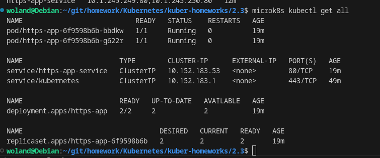
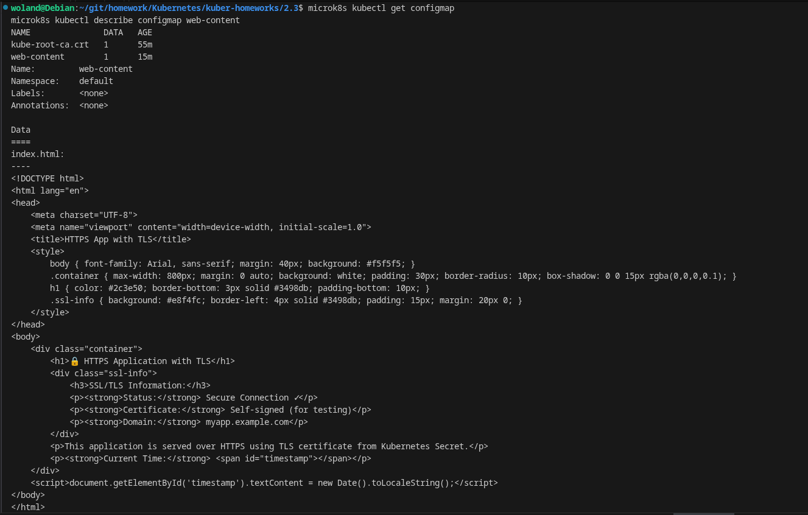
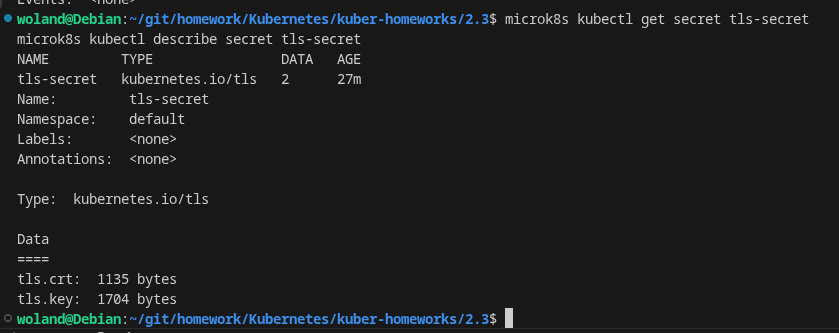
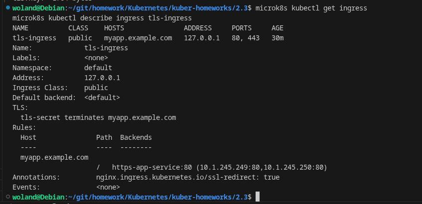
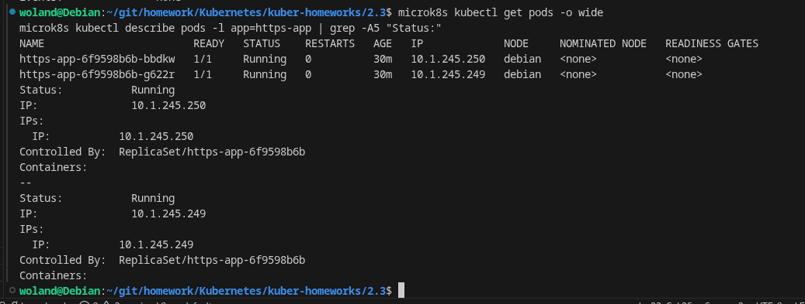
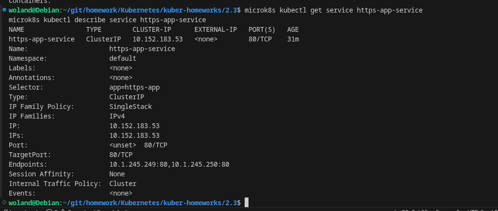
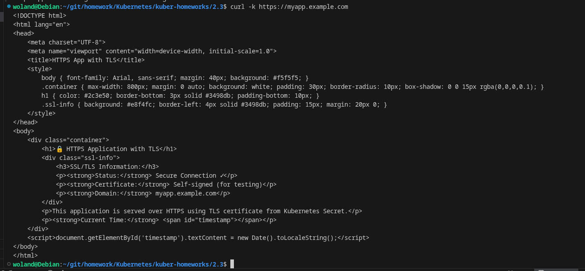
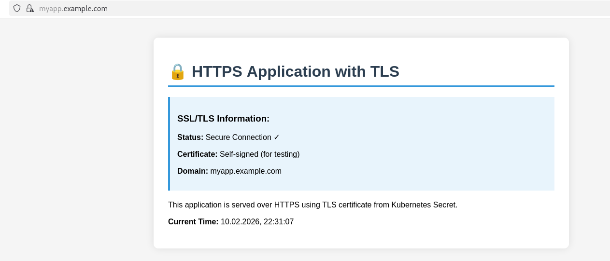

-----

## **Задание 3: Настройка RBAC**  
### **Задача**  
Создать пользователя с ограниченными правами (только просмотр логов и описания подов).

### **Шаги выполнения**  
1. **Включите RBAC в microk8s**
```bash
microk8s enable rbac
```
2. **Создать SSL-сертификат для пользователя**
```bash
openssl genrsa -out developer.key 2048
openssl req -new -key developer.key -out developer.csr -subj "/CN={ИМЯ ПОЛЬЗОВАТЕЛЯ}"
openssl x509 -req -in developer.csr -CA {CA серт вашего кластера} -CAkey {CA ключ вашего кластера} -CAcreateserial -out developer.crt -days 365
```
3. **Создать Role (только просмотр логов и описания подов) и RoleBinding**
4. **Проверить доступ**

### **Что сдать на проверку**  
- Манифесты:
  - `role-pod-reader.yaml`
  - `rolebinding-developer.yaml`
- Команды генерации сертификатов
- Скриншот проверки прав (`kubectl get pods --as=developer`)


## Решение 3

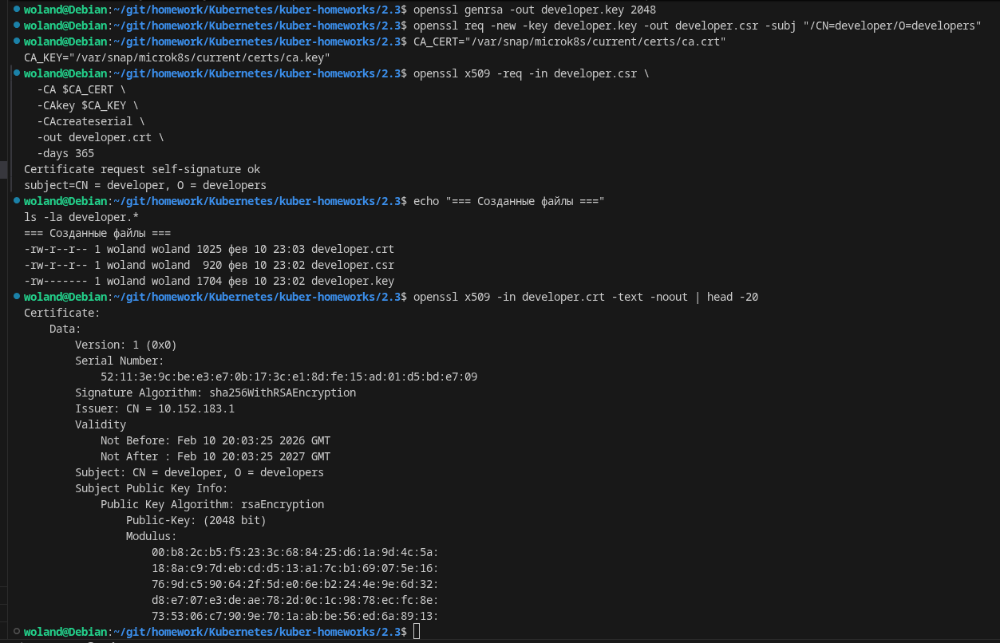
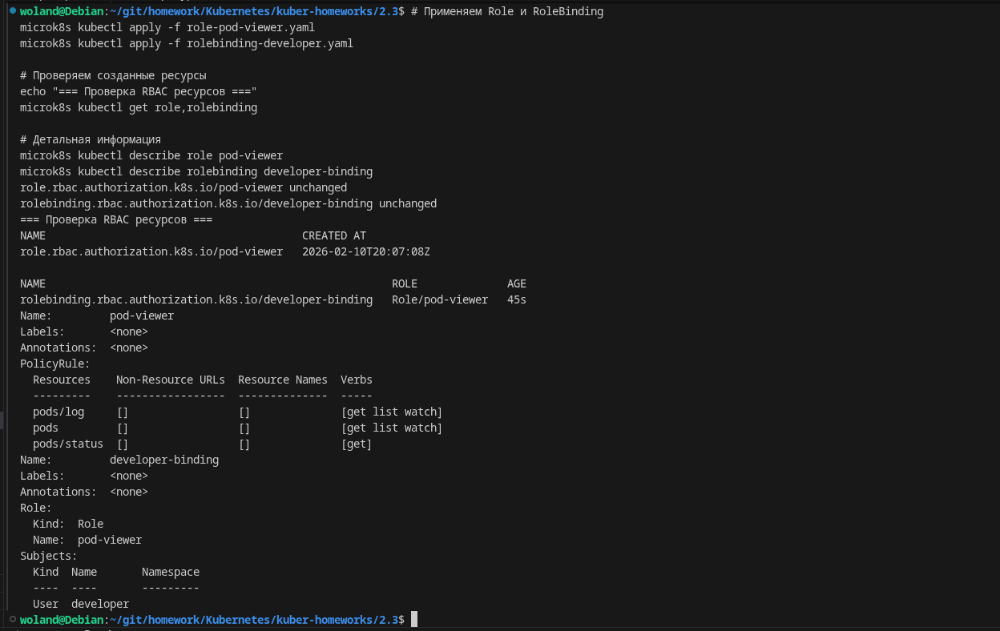
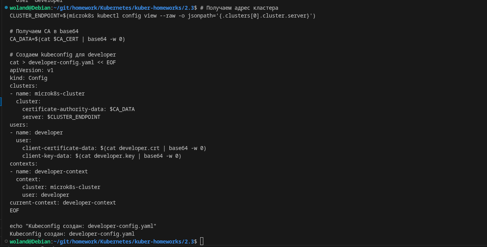
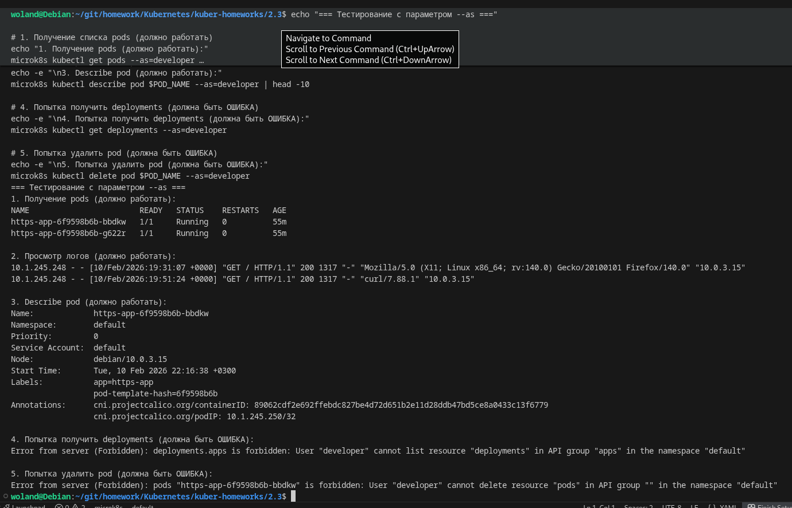
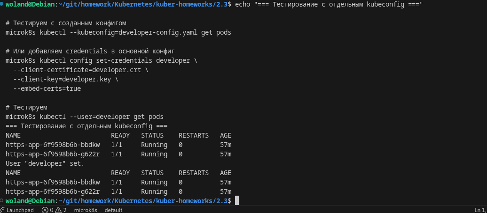
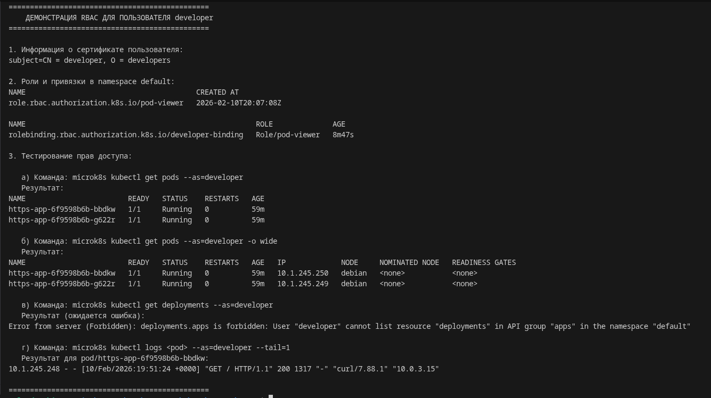

