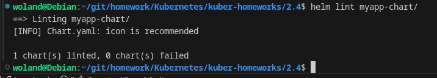
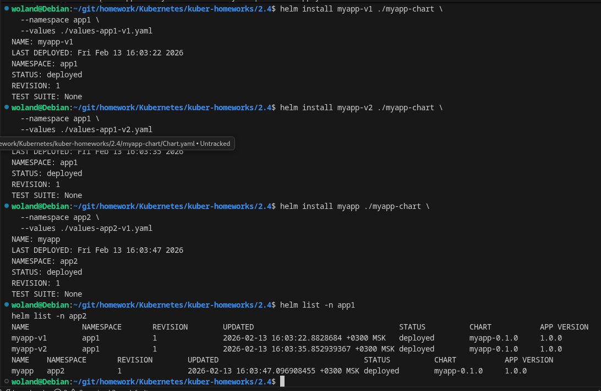
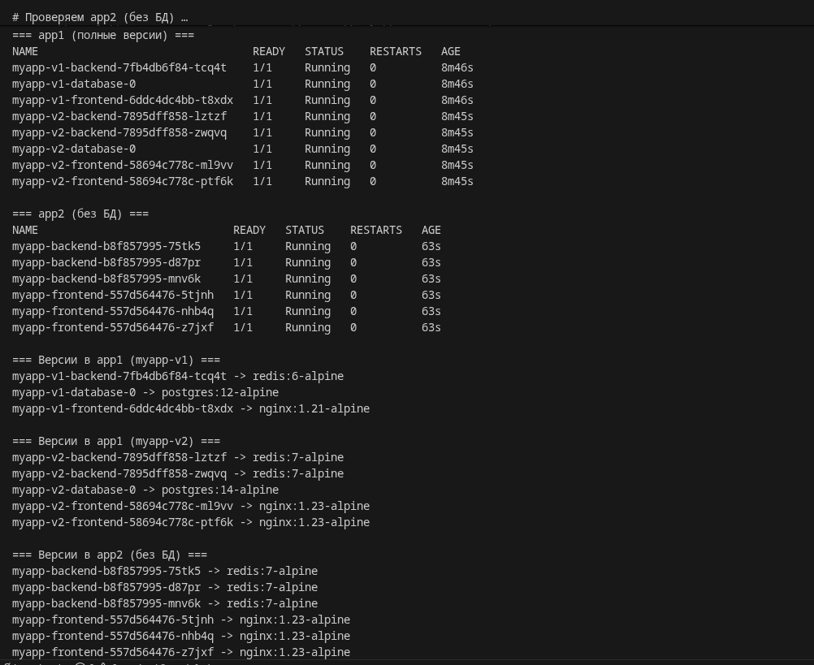

# Домашнее задание к занятию «Helm» - Барышков Михаил

## Задание 1. Подготовить Helm-чарт для приложения

1. Необходимо упаковать приложение в чарт для деплоя в разные окружения. 
2. Каждый компонент приложения деплоится отдельным deployment’ом или statefulset’ом.
3. В переменных чарта измените образ приложения для изменения версии.
----

## Решение 1

После создания всех файлов, структура должна выглядеть так:

```text
myapp-chart/
├── Chart.yaml
├── values.yaml
└── templates/
    ├── frontend-deployment.yaml
    ├── backend-deployment.yaml
    ├── database-statefulset.yaml
    ├── frontend-service.yaml
    ├── backend-service.yaml
    └── database-service.yaml
```

----

## Задание 2. Запустить две версии в разных неймспейсах

1. Подготовив чарт, необходимо его проверить. Запуститe несколько копий приложения.
2. Одну версию в namespace=app1, вторую версию в том же неймспейсе, третью версию в namespace=app2.
3. Продемонстрируйте результат.



----

## Решение 2


