# Домашнее задание к занятию «Установка Kubernetes» - Барышков Михаил


### Задание 1. Установить кластер k8s с 1 master node

1. Подготовка работы кластера из 5 нод: 1 мастер и 4 рабочие ноды.
2. В качестве CRI — containerd.
3. Запуск etcd производить на мастере.
4. Способ установки выбрать самостоятельно.

## Дополнительные задания (со звёздочкой)

**Настоятельно рекомендуем выполнять все задания под звёздочкой.** Их выполнение поможет глубже разобраться в материале.   
Задания под звёздочкой необязательные к выполнению и не повлияют на получение зачёта по этому домашнему заданию. 

------
### Задание 2*. Установить HA кластер

1. Установить кластер в режиме HA.
2. Использовать нечётное количество Master-node.
3. Для cluster ip использовать keepalived или другой способ.

### Правила приёма работы

1. Домашняя работа оформляется в своем Git-репозитории в файле README.md. Выполненное домашнее задание пришлите ссылкой на .md-файл в вашем репозитории.
2. Файл README.md должен содержать скриншоты вывода необходимых команд `kubectl get nodes`, а также скриншоты результатов.
3. Репозиторий должен содержать тексты манифестов или ссылки на них в файле README.md.

----

## Решение 1

1. Развертывание 5 нод: 1 мастер и 4 рабочие ноды решил делать в yandex cloud  через terraform

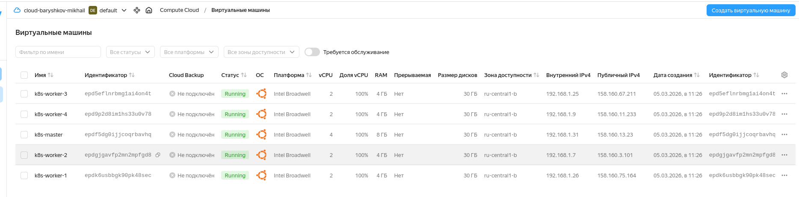

2. После развертывание мастер-ноды зашел на неё по ssh и установил CRI — containerd

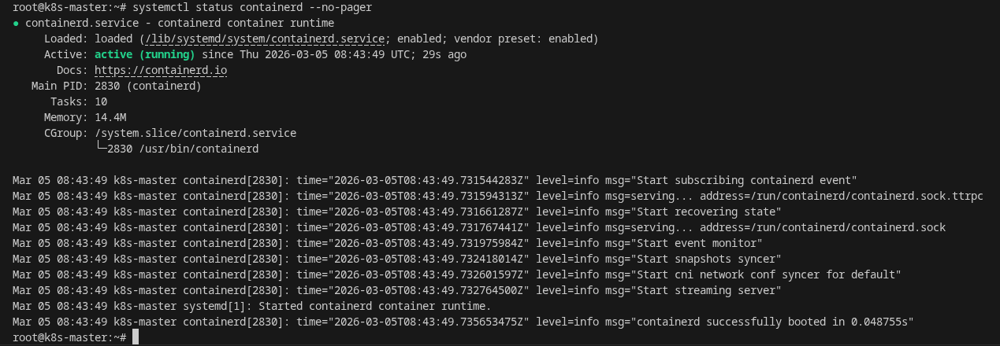

3. Создаем скрипт install-k8s-tools.sh коорый скпируем на все ноды и запусти его

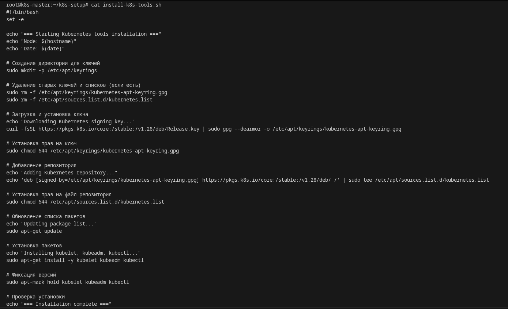
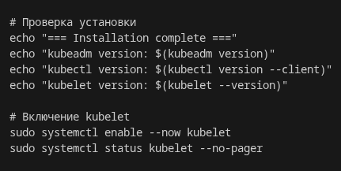

4. Получаем список IP всех нод.

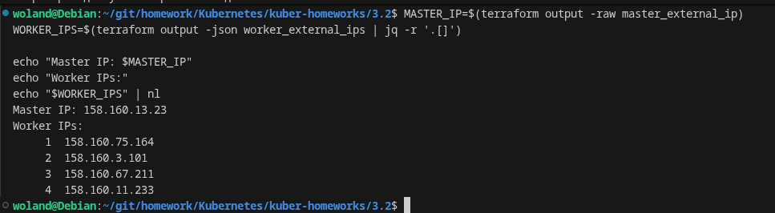

5. Копируем скрипт на все ноды

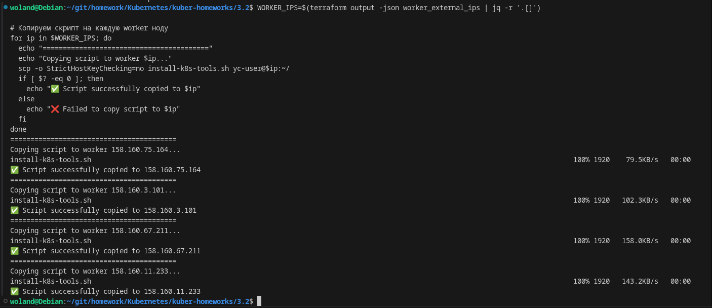

6. Запускаем скрипт на всех нодах

```bash
# Создаем директорию для логов
mkdir -p ~/k8s-logs

# Запускаем скрипт на каждой worker ноде
for ip in $WORKER_IPS; do
  echo "========================================="
  echo "🚀 Setting up worker node: $ip"
  echo "========================================="
  
  echo "----- Worker $ip -----" >> ~/k8s-logs/worker-setup.log
  echo "Date: $(date)" >> ~/k8s-logs/worker-setup.log
  
  # Запускаем скрипт и сохраняем вывод
  ssh -o StrictHostKeyChecking=no yc-user@$ip "bash ~/install-k8s-tools.sh" 2>&1 | tee -a ~/k8s-logs/worker-setup.log
  
  if [ ${PIPESTATUS[0]} -eq 0 ]; then
    echo "✅ Worker $ip setup completed successfully"
  else
    echo "❌ Worker $ip setup failed"
  fi
  
  echo "" >> ~/k8s-logs/worker-setup.log
  echo ""
done

echo "All workers setup completed! Log saved to ~/k8s-logs/worker-setup.log"
```

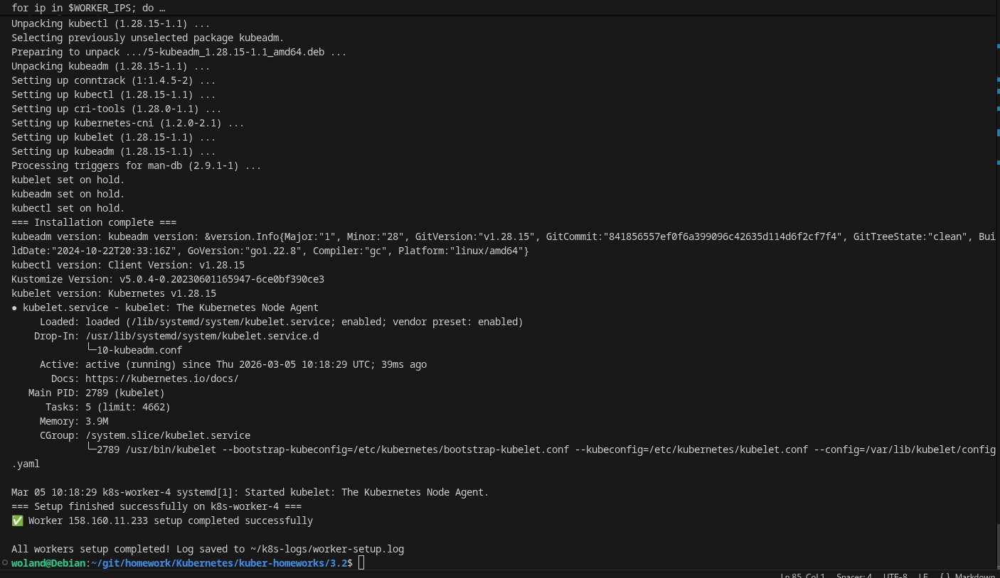

7. Проверка результатов

```bash
# Проверка, что скрипт скопировался на все ноды
for ip in $WORKER_IPS; do
  echo "Checking $ip:"
  ssh yc-user@$ip "ls -la ~/install-k8s-tools.sh"
  echo "---"
done

# Проверка версий на всех worker нодах
echo ""
echo "=== Versions on worker nodes ==="
for ip in $WORKER_IPS; do
  echo "Worker $ip:"
  ssh yc-user@$ip "kubeadm version 2>/dev/null | head -1 || echo 'kubeadm not installed'"
  ssh yc-user@$ip "kubectl version --client 2>/dev/null | head -2 | tail -1 || echo 'kubectl not installed'"
  ssh yc-user@$ip "kubelet --version 2>/dev/null || echo 'kubelet not installed'"
  echo "---"
done
```
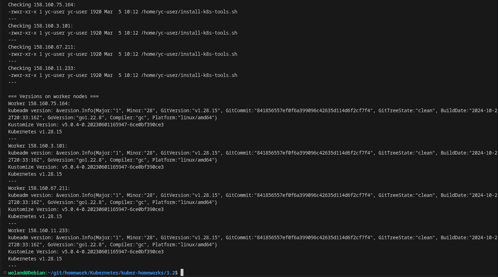

8. На мастер ноуде запускаем класте.

```bash
sudo kubeadm init --pod-network-cidr=10.244.0.0/16
```

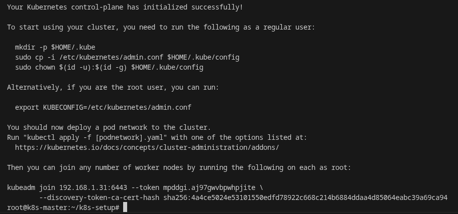
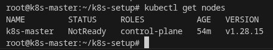

9. Присоединение worker нод к кластеру

```bash
for ip in $WORKER_IPS; do
  echo "========================================="
  echo "Joining worker node: $ip"
  echo "========================================="
  
  ssh -o StrictHostKeyChecking=no yc-user@$ip "sudo $JOIN_CMD"
  
  if [ $? -eq 0 ]; then
    echo "✅ Worker $ip joined successfully"
  else
    echo "❌ Worker $ip failed to join"
  fi
  echo ""
done
```
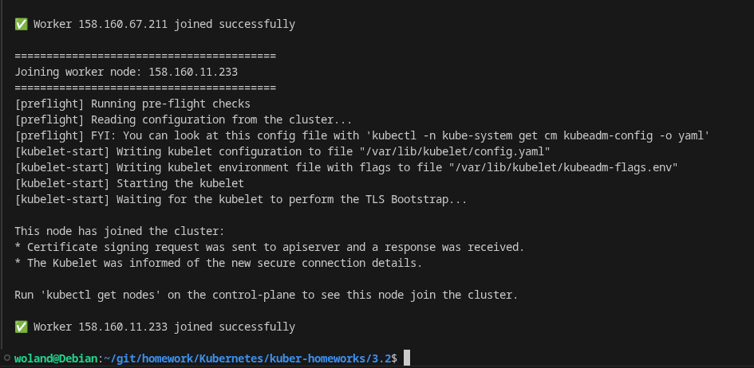

10. Финальная проверка на мастер-ноде

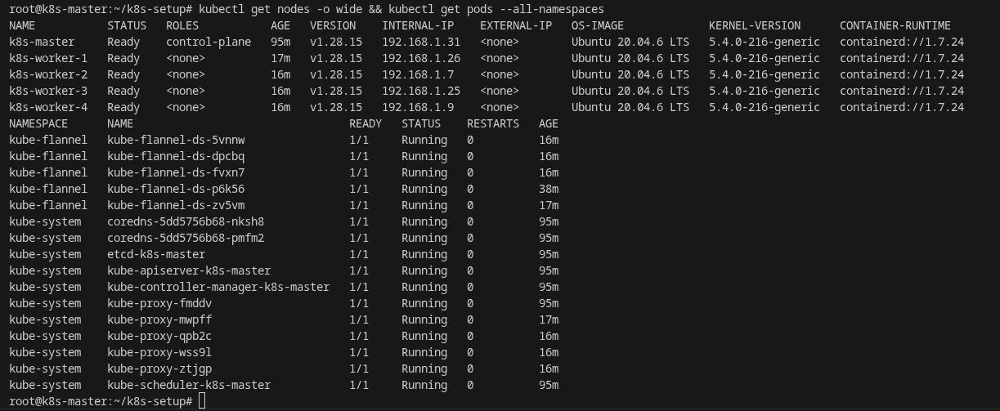
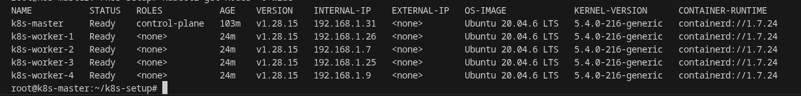
