# Домашнее задание к занятию «Как работает сеть в K8s» - Барышков Михаил

## Цель задания

Настроить сетевую политику доступа к подам.

## Чеклист готовности к домашнему заданию

1. Кластер K8s с установленным сетевым плагином Calico.

## Задание 1. Создать сетевую политику или несколько политик для обеспечения доступа

1. Создать deployment'ы приложений frontend, backend и cache и соответсвующие сервисы.
2. В качестве образа использовать network-multitool.
3. Разместить поды в namespace App.
4. Создать политики, чтобы обеспечить доступ frontend -> backend -> cache. Другие виды подключений должны быть запрещены.
5. Продемонстрировать, что трафик разрешён и запрещён.

## Решение 1

### Создание манифестов deployment'ов и сервисов

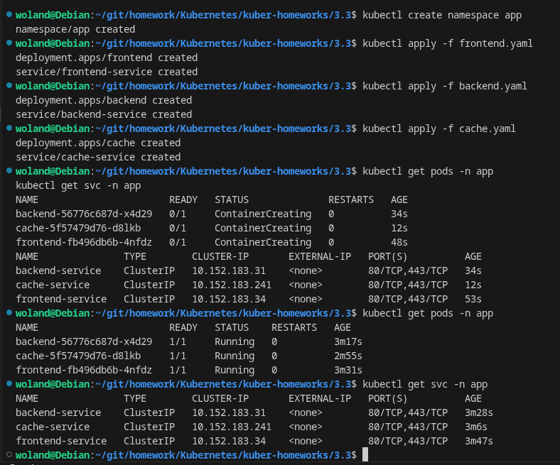

### Создание сетевых политик

[deny-all.yaml](deny-all.yaml)

### Политика для доступа frontend -> backend

[frontend-to-backend.yaml](frontend-to-backend.yaml)

### Политика для доступа backend -> cache
[backend-to-cache.yaml](backend-to-cache.yaml)

### Политика для разрешения egress трафика

[allow-egress.yaml](allow-egress.yaml)

### Создадим политику для разрешения DNS трафика

[allow-dns.yaml](allow-dns.yaml)

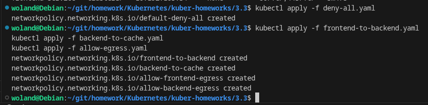

### Проверка сетевых политик

Получение IP-адресов подов

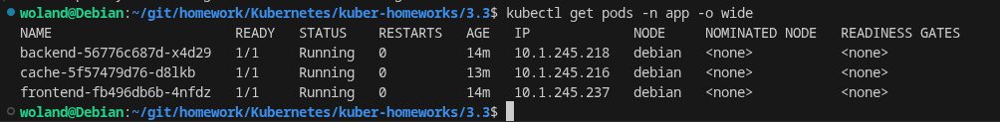

----


## Тест 1: Проверка доступа frontend -> backend (должен работать)

Зайдем в под frontend и проверим доступ к backend:

```bash
kubectl exec -it -n app frontend-xxx -- /bin/bash
curl http://backend-service.app.svc.cluster.local:80
```

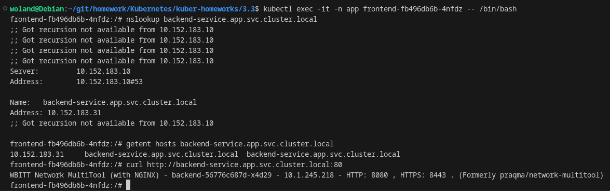

## Тест 2: frontend -> cache (должен быть запрещен)

```bash
curl http://cache-service.app.svc.cluster.local:80 --connect-timeout 5
```
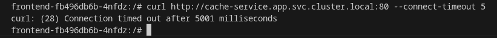

## Тест 3: backend -> cache (должен работать)

```bash
kubectl exec -it -n app backend-56776c687d-x4d29 -- /bin/bash
curl http://cache-service.app.svc.cluster.local:80
```
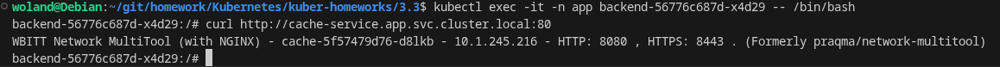


##  Тест 4: backend -> frontend (должен быть запрещен)

```bash
curl http://frontend-service.app.svc.cluster.local:80 --connect-timeout 5
```

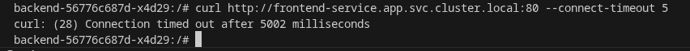

## Тест 5: cache -> любой под (должен быть запрещен)

```bash
# Заходим в cache под
kubectl exec -it -n app cache-5f57479d76-d8lkb -- /bin/bash

# Проверяем доступ к frontend
curl http://frontend-service.app.svc.cluster.local:80 --connect-timeout 5

# Проверяем доступ к backend
curl http://backend-service.app.svc.cluster.local:80 --connect-timeout 5
```

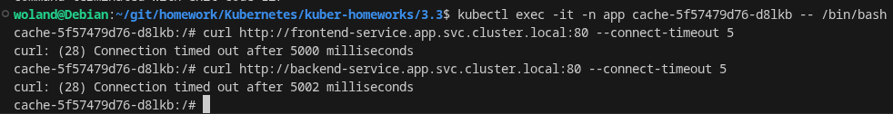

## Проверка политик

```bash
# Проверяем все политики в namespace app
kubectl get networkpolicies -n app

# Детальный просмотр каждой политики
kubectl describe networkpolicy -n app default-deny-all
kubectl describe networkpolicy -n app allow-dns
kubectl describe networkpolicy -n app frontend-to-backend
kubectl describe networkpolicy -n app backend-to-cache
kubectl describe networkpolicy -n app allow-frontend-egress
kubectl describe networkpolicy -n app allow-backend-egress
```

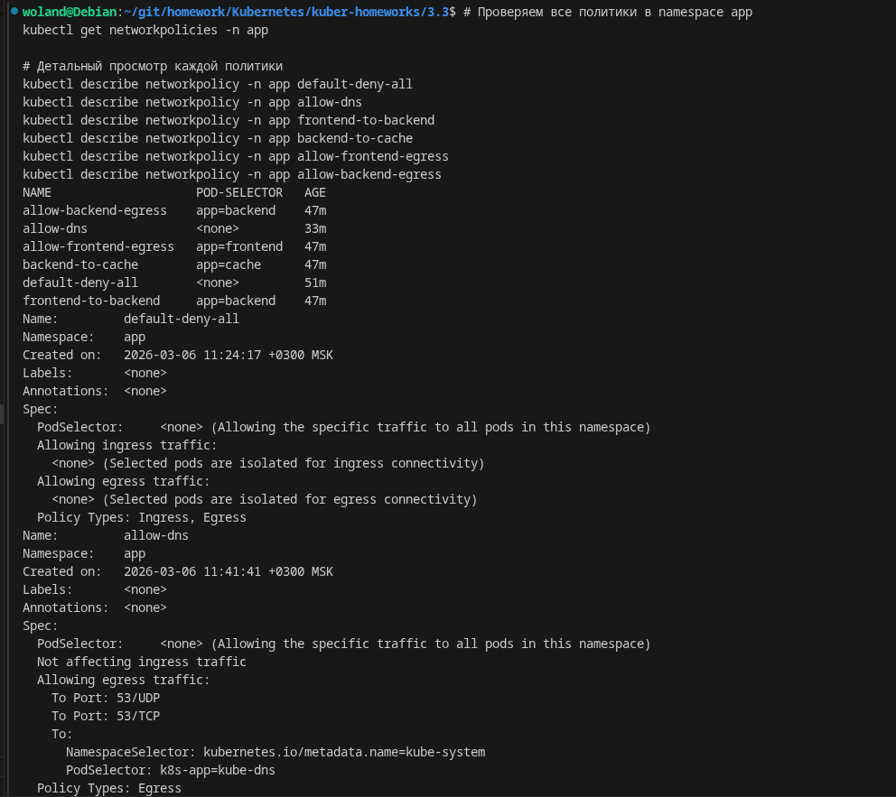
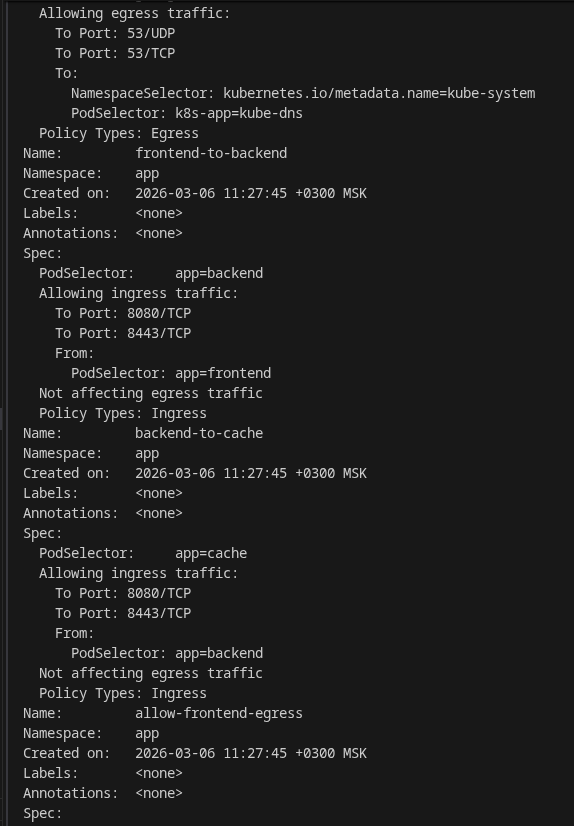
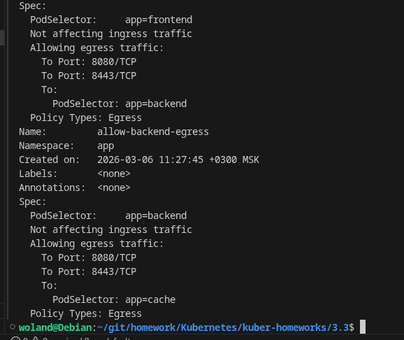