# Домашнее задание к занятию «Обновление приложений» - Барышков Михаил

### Цель задания

Выбрать и настроить стратегию обновления приложения.

### Задание 1. Выбрать стратегию обновления приложения и описать ваш выбор

1. Имеется приложение, состоящее из нескольких реплик, которое требуется обновить.
2. Ресурсы, выделенные для приложения, ограничены, и нет возможности их увеличить.
3. Запас по ресурсам в менее загруженный момент времени составляет 20%.
4. Обновление мажорное, новые версии приложения не умеют работать со старыми.
5. Вам нужно объяснить свой выбор стратегии обновления приложения.

### Задание 2. Обновить приложение

1. Создать deployment приложения с контейнерами nginx и multitool. Версию nginx взять 1.19. Количество реплик — 5.
2. Обновить версию nginx в приложении до версии 1.20, сократив время обновления до минимума. Приложение должно быть доступно.
3. Попытаться обновить nginx до версии 1.28, приложение должно оставаться доступным.
4. Откатиться после неудачного обновления.

## Дополнительные задания — со звёздочкой*

Задания дополнительные, необязательные к выполнению, они не повлияют на получение зачёта по домашнему заданию. **Но мы настоятельно рекомендуем вам выполнять все задания со звёздочкой.** Это поможет лучше разобраться в материале.   

### Задание 3*. Создать Canary deployment

1. Создать два deployment'а приложения nginx.
2. При помощи разных ConfigMap сделать две версии приложения — веб-страницы.
3. С помощью ingress создать канареечный деплоймент, чтобы можно было часть трафика перебросить на разные версии приложения.
----

## Решение 1. Выбор стратегии обновления

### Исходные данные:
- Многокомпонентное приложение, запущенное в нескольких репликах
- Ресурсы кластера ограничены, возможность увеличения отсутствует
- В часы наименьшей нагрузки есть запас ресурсов 20%
- Обновление мажорное — новая версия несовместима со старой

### Анализ доступных стратегий:

| Стратегия | Описание | Преимущества | Недостатки для данного случая |
|-----------|----------|--------------|-------------------------------|
| **Recreate** | Удаление всех старых подов, затем создание новых | Простота, гарантия отсутствия двух версий одновременно | Полный простой приложения на время обновления |
| **RollingUpdate** (стандарт) | Постепенная замена подов | Отсутствие простоя | Одновременная работа старой и новой версий |
| **RollingUpdate** (кастомизированный) | Настройка параметров maxSurge/maxUnavailable | Гибкость, возможность адаптации под условия | Требует точного расчёта параметров |

### Обоснование выбора:

Стандартный **RollingUpdate** не подходит, так как при мажорном обновлении недопустима одновременная работа старой и новой версий — это может привести к ошибкам в работе приложения.

**Recreate** также неприемлем, поскольку приводит к простою, а условиями задания требуется доступность приложения.

Оптимальным решением становится **кастомизированная стратегия RollingUpdate** со следующими параметрами:
- **`maxSurge: 0`** — запрет на создание новых подов сверх заданного количества реплик
- **`maxUnavailable: 1`** (или 20%) — возможность временного уменьшения количества работающих реплик на одну

### Механизм работы выбранной стратегии:

1. При обновлении Kubernetes останавливает один под со старой версией
2. Количество работающих подов временно снижается до 4 (на 20% меньше нормы)
3. Освободившиеся ресурсы позволяют создать один под с новой версией
4. Процесс повторяется для каждой реплики

### Преимущества выбранного подхода:

- **Отсутствие простоя** — приложение продолжает работать на 4 подах из 5
- **Нет смешивания версий** — в каждый момент времени работают поды только одной версии
- **Соответствие ресурсным ограничениям** — временное снижение количества подов на 20% компенсирует отсутствие свободных ресурсов
- **Безопасность данных** — исключена ситуация, когда старая и новая версии одновременно обращаются к одним данным

### Итоговый выбор:

**Стратегия `RollingUpdate` с параметрами:**

```yaml
strategy:
  type: RollingUpdate
  rollingUpdate:
    maxSurge: 0
    maxUnavailable: 1
```

Данная стратегия оптимально решает поставленные задачи:

- обеспечивает доступность приложения в процессе обновления
- гарантирует отсутствие совместной работы несовместимых версий
- учитывает ограниченность ресурсов (20% запаса)

---

## Решение 2

### Проверка готовности кластера
 
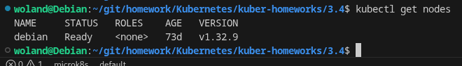

### Создание Deployment и проверка подов

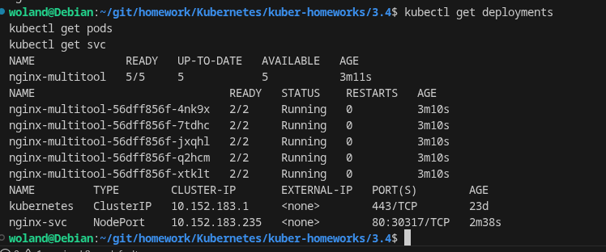

### Проверим версию nginx в контейнерах

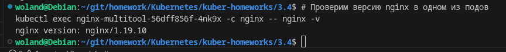

### Проверка доступности приложения

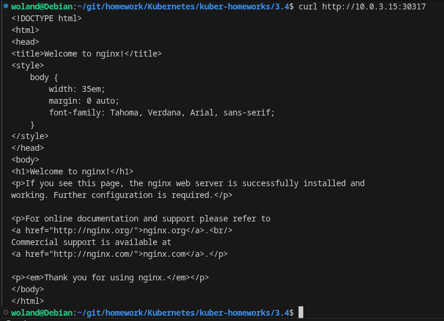

###  Обновление до nginx 1.20

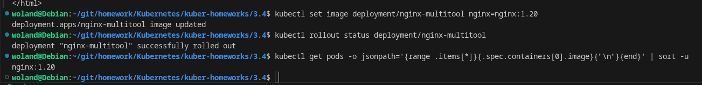
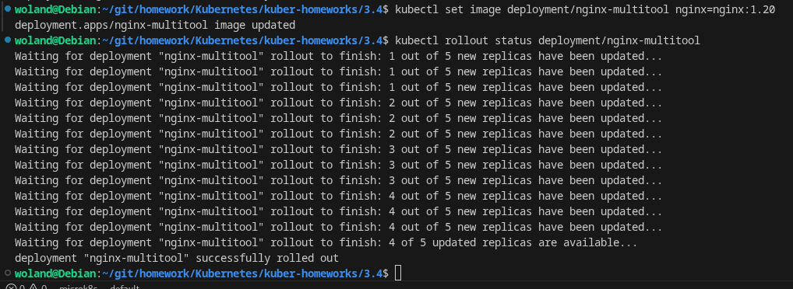
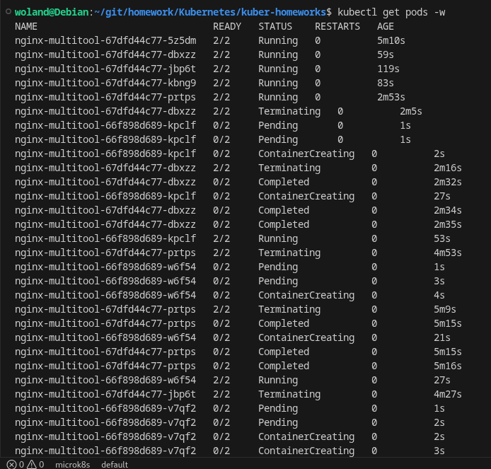


## Настройка стратегии для мажорного обновления

Сначала изменим стратегию обновления Deployment согласно выбранной в Задании 1 (maxSurge: 0, maxUnavailable: 1):

Создаем файл с новой стратегией [deployment-strategy-update.yaml](deployment-strategy-update.yaml)

Проверяем, что стратегия изменилась:

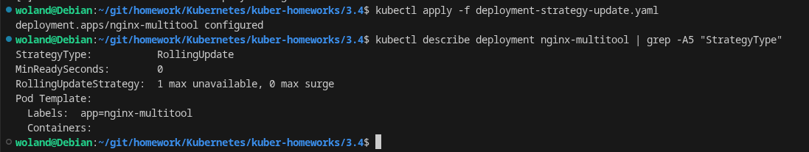

## Попытка обновления до версии 1.28

Теперь пробуем обновить до несуществующей версии:

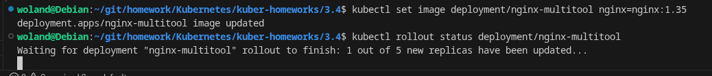
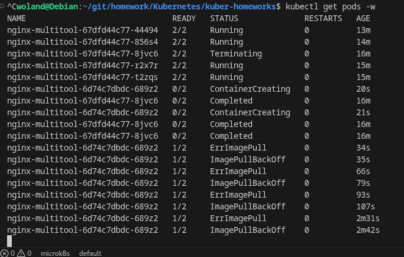
Статус обновления (завис)

Мы видим - ошибку обновления! Стратегия maxSurge: 0, maxUnavailable: 1 работает как надо:

- Один под (старый) завершается
- Создается новый под с версией 1.35
- Новый под не может запуститься (ErrImagePull/ImagePullBackOff)
- Остальные 4 пода продолжают работать
- Процесс обновления останавливается, ожидая успешного запуска нового пода

## Теперь выполняем откат

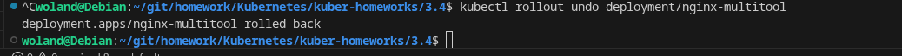
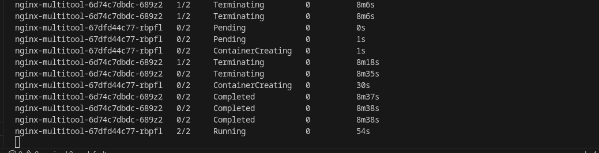

## Проверяем результат после отката

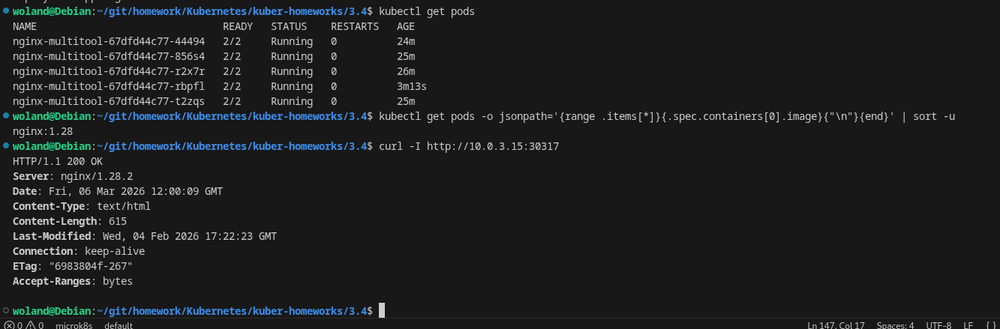