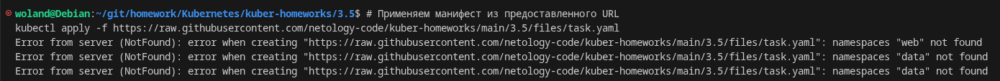
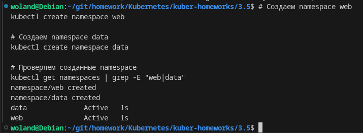
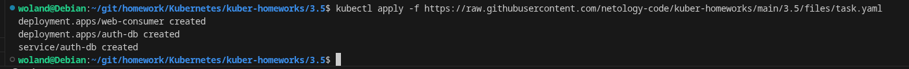
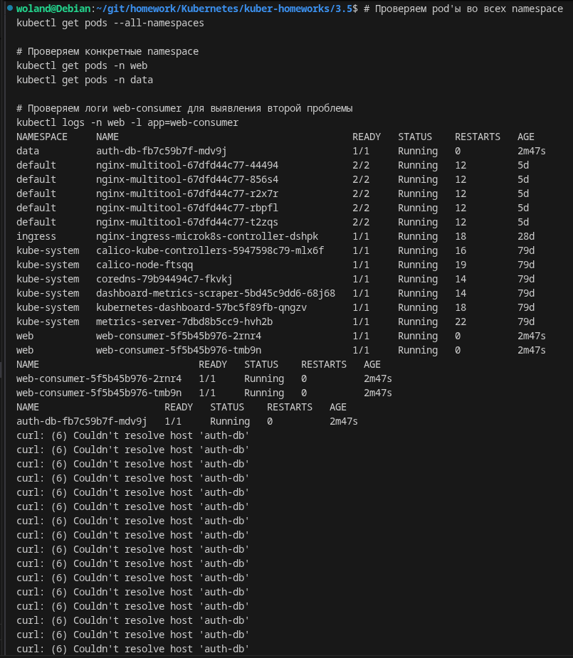
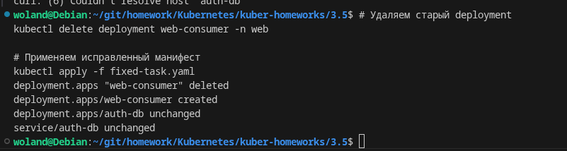
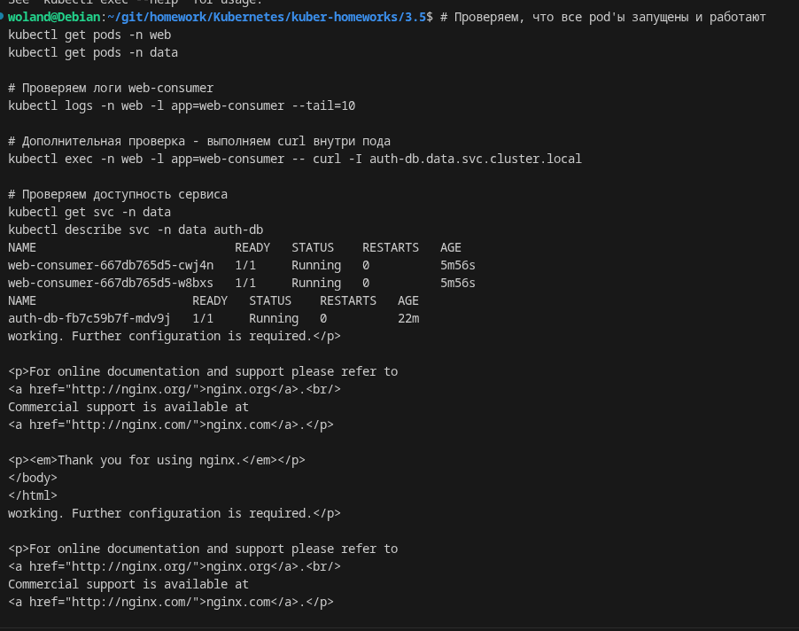
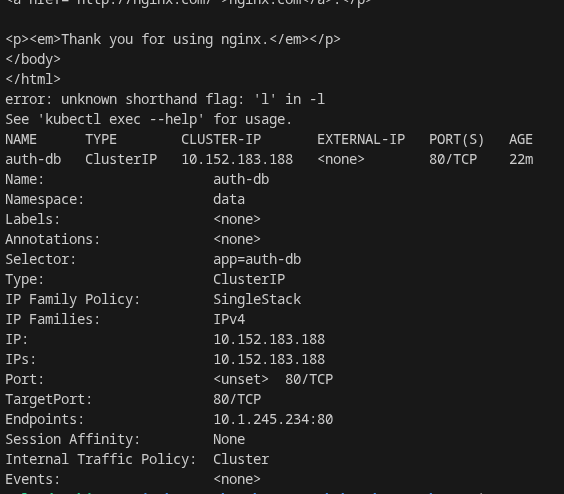
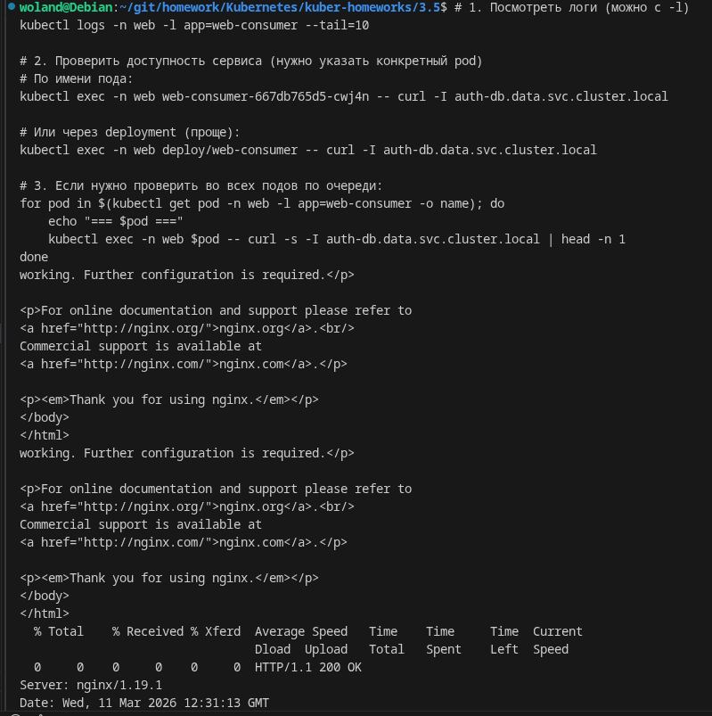
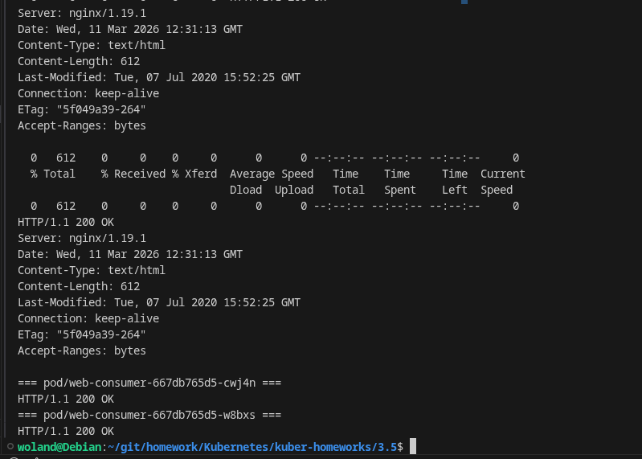

# Домашнее задание к занятию Troubleshooting -Барышков Михаил

## Задание. При деплое приложение web-consumer не может подключиться к auth-db. Необходимо это исправить

1. Установить приложение по команде:
```shell
kubectl apply -f https://raw.githubusercontent.com/netology-code/kuber-homeworks/main/3.5/files/task.yaml
```
2. Выявить проблему и описать.
3. Исправить проблему, описать, что сделано.
4. Продемонстрировать, что проблема решена.

## Решение

1. Установка приложения



2. Создание необходимых namespace'ов



3. Применение исходного манифеста



4. Проверка состояния pod'ов и ожидаемый вывод логов:



5. Создаем исправленный манифест [fixed-task.yaml](fixed-task.yaml)



6. Проверка работоспособности







##     Выявленные проблемы

В процессе выполнения были обнаружены две проблемы:

Проблема 1 (инфраструктурная): Отсутствие namespace'ов web и data

- При первом применении манифеста получена ошибка Error from server (NotFound): namespaces "web" not found

- Это стандартная ситуация: перед созданием ресурсов в namespace, сам namespace должен существовать

Проблема 2 (сетевая): Неправильное обращение к сервису между namespace

- В логах pod'ов web-consumer наблюдались ошибки: curl: (6) Couldn't resolve host 'auth-db'

- Pod'ы в namespace web пытались обратиться к сервису auth-db по короткому имени, хотя сервис находится в namespace data